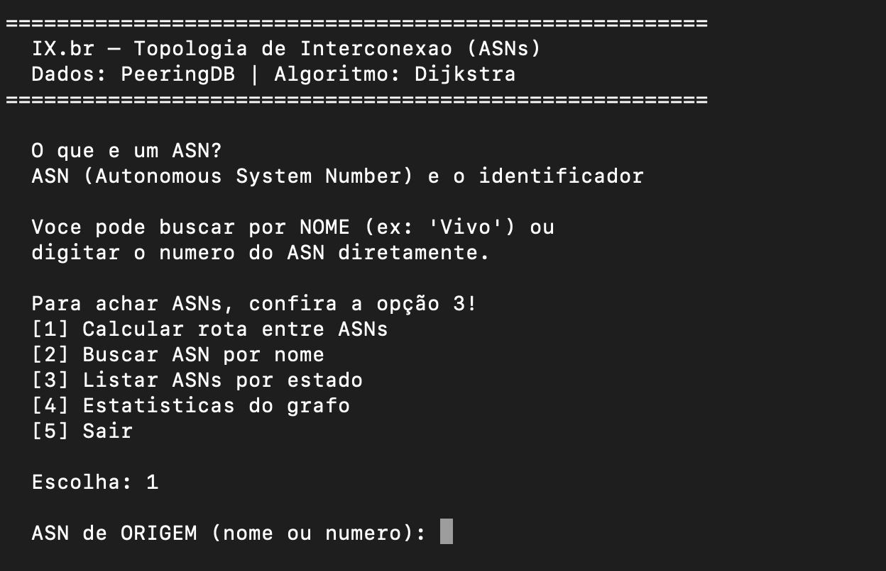
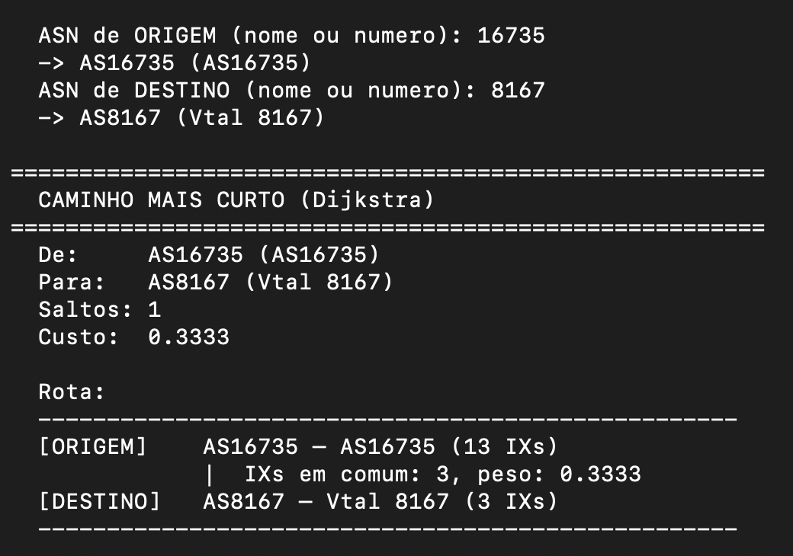
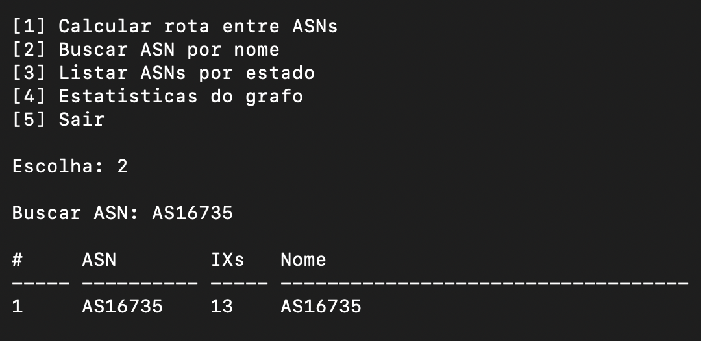
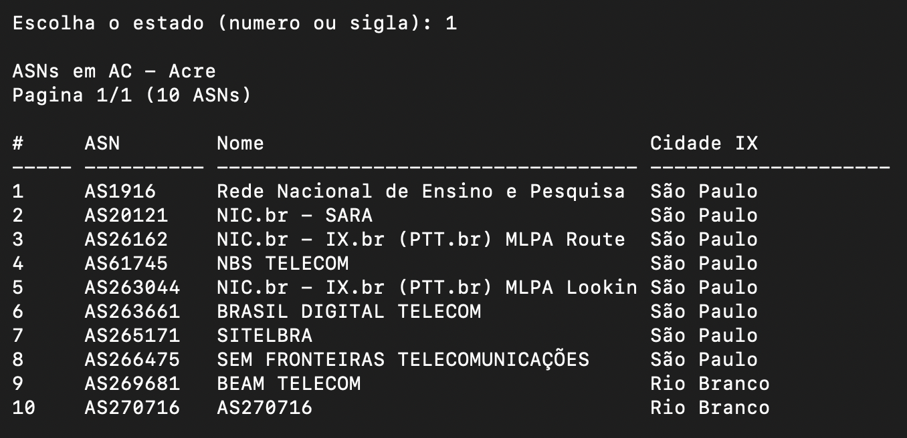
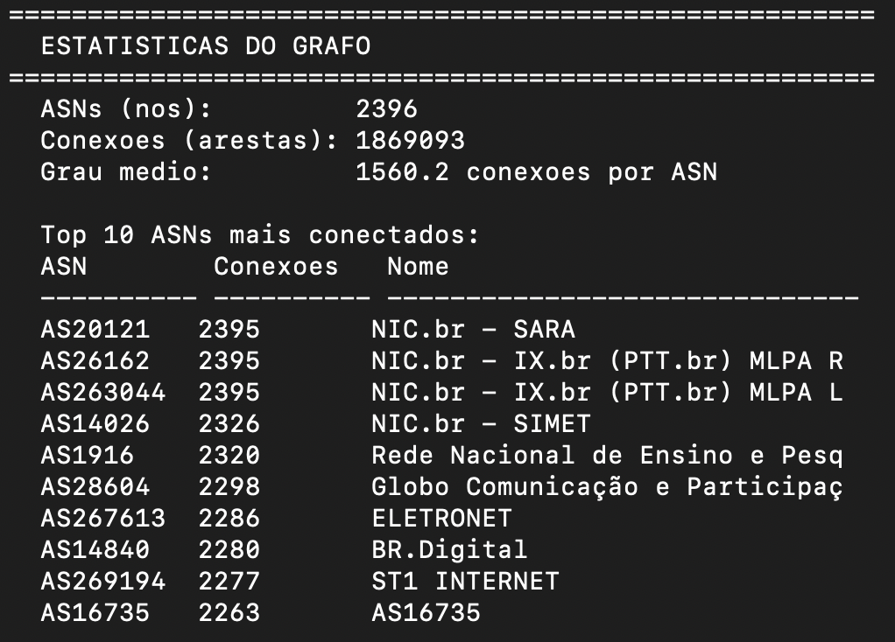

# G10_Grafos_PA-26.1

Número da Lista: 1<br>
Conteúdo da Disciplina: Grafos<br>

---

## Alunos
|Matrícula | Aluno |
| :-------: | :------------------------------: |
| 23/1038072  |  Gabriel Dantas Bevilaqua Mendes |
| 23/1026483  |  Maria Eduarda de Amorim Galdino |

---

## Sobre 
Este projeto analisa a topologia de interconexão do IX.br usando dados do PeeringDB. O sistema coleta informações de IXs e ASNs, constrói um grafo de conectividade entre ASNs e calcula o caminho mais curto entre dois ASNs com o algoritmo de Dijkstra.

- **IX (Internet Exchange)**: ponto de troca de tráfego onde provedores de internet e redes se conectam diretamente entre si para trocar dados de forma eficiente.
- **ASN (Autonomous System Number)**: identificador único atribuído a cada rede autônoma na internet, usado para roteamento e para mapear como as redes se conectam entre si.

---

## Screenshots
A seguir estão os screenshots do projeto:

#### Menu Principal do Projeto 


#### Cálculo Dijkstra para o caminho mais curto


#### Busca de ASN por nome


#### Lista de ASN por estado 


#### Estatísticas do Grafo


---

## Instalação 
Linguagem: Python<br>
Pré-requisitos:
- Python 3 instalado
- Internet para coletar dados do PeeringDB (na primeira execução)

Recomenda-se usar um ambiente virtual para isolar as dependências do projeto. Dentro da pasta do projeto, crie e ative o ambiente virtual:
```bash
python3 -m venv .venv
source .venv/bin/activate
```
Instale as dependências no ambiente virtual:
```bash
python3 -m pip install -r requirements.txt
```

---

## Uso 
Rode o projeto com:
```bash
python3 src/main.py
```

Para calcular o caminho direto entre dois ASNs sem entrar no menu interativo, use:
```bash
python3 src/main.py 16735 8167
```

O sistema também oferece buscas por ASN por nome ou número e exibe estatísticas do grafo.

---

## Outros 
O projeto usa cache local em `src/ixbr_cache.json` para evitar múltiplas consultas ao PeeringDB.
Se quiser atualizar os dados, remova o arquivo de cache e execute o programa novamente.

## Link do vídeo
Para acessar a apresentação, clique neste link: <br>